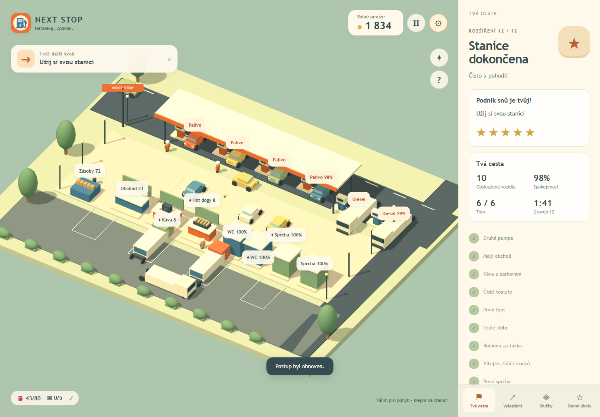

# Next Stop — Gas Station

A playable 3D game for mobile and desktop browsers. A single pump grows into a station for cars and trucks, with a shop, snacks, and clean facilities. A standalone project; it shares tools and small helper modules with RestaurantCommon.

## Running

Requires Node.js 22.12+ and WebGL 2. Keep the sibling folders GasStation and RestaurantCommon together. Run `npm ci` once in RestaurantCommon, then in GasStation:

```powershell
npm run dev
npm test
npm run build
npm run preview
```

Both dev and the regular preview use http://localhost:4175. For a parallel preview, use `node ../RestaurantCommon/scripts/serve.mjs gas --preview --port 4185`. A phone on the same network can use the Network address printed by the server.

The build in GasStation/dist can be published on its own to static HTTPS hosting, including in a subdirectory. PWA and offline launch need HTTPS/localhost and a completed first online load. A plain LAN HTTP address is only for trying the game out.

## Contents

- Six phases, 12 expansions, partial funding, an ending, and continued play after completion.
- Cars and trucks, compatible pumps and parking, guided drive-throughs, drivers walking between services.
- Two fuel types, storage, and orders; automatic logistics later on.
- Six shop categories with their own stock and net profit: water, snacks, travel supplies, car care, driver supplies, souvenirs.
- Coffee and hot dogs with input stock and timed preparation.
- Restrooms/showers: quality, cleanliness, occupancy, and reopening only after a complete cleanup.
- Six professions, six upgrade tracks, three character looks, daily goals.
- Custom procedural 3D models, animations, carried stock, sounds, power-saving graphics, and pause.
- Twenty languages, automatic browser detection, manual switching, Arabic RTL.
- Autosave, export/import, a confirmed reset, protection of an unreadable backup, and limited offline income.

No account, ads, payments, remote analytics, or external models/fonts at runtime.

## Controls

WASD/arrow keys or finger drag. Tapping a service label walks the character to that spot. Manual movement, opening a panel, pause, and loss of focus cancel the automatic path. The crosshair toggles between following the character and an overview of the station.

At a pump, standing in the service zone starts refueling. In the warehouse you pick up boxes, and at a service they are unloaded automatically. You clean a restroom/shower by standing nearby, unless it is occupied. Employees gradually take over these tasks.

The **Services** panel shows fuel, shelves, food preparation, hygiene, and the delivery price quote. Fuel, diesel, and supply boxes cost 1 coin per unit. Before ordering you see the quantity, the total price, and the remaining cash. Payment is made once at order time; exactly the ordered load arrives after 24 seconds. With a low budget, the offer shrinks the delivery. Clicking the warehouse opens the offer and a button for picking up the supplies.

Starting stock is part of a new game. With zero cash and fewer than 4 units of car fuel, 8 units of emergency fuel are available on an interest-free loan; 8 coins are repaid automatically from further revenue. A new loan cannot be taken before the previous one is repaid. Automatic logistics uses the same rules and pays from free money. A sale credits gross revenue (car 16, truck 64 coins); the purchase cost is not deducted a second time. The offline reward is based on the net cash gain after paying for deliveries.

The save uses `next-stop:save:v1`, the preferences `next-stop:preferences`. An unreadable or future-version save is not overwritten automatically. The protection ends with a valid import or an explicit reset.

## Validation and documentation

In RestaurantCommon, run `npm run typecheck` and `npm run test:e2e`; build all games before the browser tests. GasStation's own tests are run by `npm test`.

[Results and limits](VALIDATION.md) · [Graphics origin](ASSETS.md) · [Specification](../SPEC.md) · [Competitor research](../RESEARCH.md)

Twenty simulation runs with pedestrian collisions: 47.54–49.78 minutes. This is not a measurement of human enjoyment or retention. A physical Android/iPhone and native stores were not verified. A car wash, service, charging, a motel, and other maps belong to possible future versions.




## New game interface

A full-screen grounds view, a floating HUD, and a bottom menu; management opens only on demand. Two expansions can be compared side by side. Close a panel with the cross, by tapping outside it, or with Escape. [UI research and design](UI-REDESIGN-2026-10-01.md).
